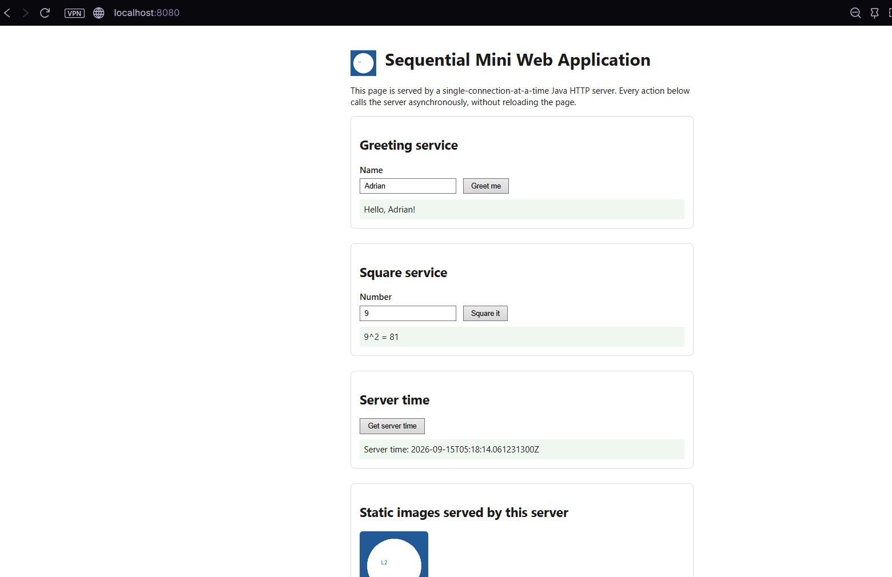
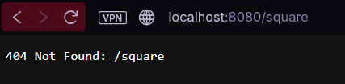
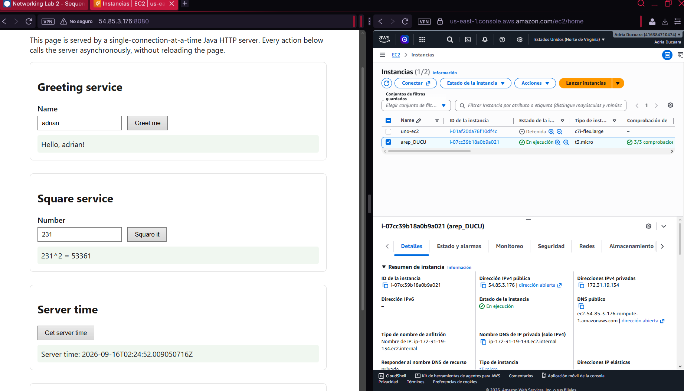

# Networking Lab 2 — From a Minimal HTTP Server to a Web Application on AWS

## 1. Project description

This project extends a minimal, socket-based Java HTTP server into a small sequential
web application. It serves static resources (HTML, JavaScript, images), exposes four
hardcoded JSON services, and runs both locally and on a single AWS EC2 instance.

The problem it addresses is pedagogical: before distributing load across multiple
servers or threads, it is necessary to understand what a single, sequential server
actually does — where requests wait, what one connection costs, and which design
decisions (statelessness, explicit routing, byte-accurate responses) make future
concurrency and distribution possible. This lab intentionally stops short of
concurrency: **no threads, thread pools, or routing frameworks are used.**

## 2. System metaphor and architecture

**Metaphor: a single-window teller counter.** Imagine one bank teller (the server)
serving one customer (an HTTP connection) at a time, from one counter (the
`ServerSocket`, bound once and kept open for the life of the process). A customer
walks up, hands over a slip of paper with a request (the HTTP request line), the
teller reads it, does exactly one of three things — hands over a form/photo from
the filing cabinet (a static resource), performs one of four fixed calculations from
a printed reference sheet (a hardcoded service), or says "that's not something we
handle" (404/405/400) — and only then calls the next customer. The teller never
starts a second customer's request before finishing the first: that is the sequential
constraint at the heart of this lab. The browser is the customer's assistant: it can
prepare and send several slips at once *from the customer's side* (the asynchronous
JS client), but the teller counter itself still processes them one at a time.

**Components and responsibilities:**

- **Browser (JS client, `webroot/app.js`)** — sends `fetch()` requests to
  `/api/...` endpoints without reloading the page; shows loading/result/error states.
- **HTTP request line over TCP** — the protocol contract between browser and server.
- **`SimpleHttpServer`** — owns the listening `ServerSocket`; accepts one connection
  at a time, in a loop, forever. This is the counter.
- **`HttpRequestParser` / `HttpRequest`** — reads raw bytes off the socket and turns
  them into a parsed method + path + query params.
- **`StaticFileHandler`** — the filing cabinet: serves files from `webroot/`,
  normalizing and validating paths so nothing outside `webroot/` is ever reachable.
- **`ApiHandler`** — the reference sheet: recognizes exactly four hardcoded paths
  with explicit `if`/`else`, computes a response, and returns JSON.
- **`HttpResponse`** — writes a correct HTTP/1.1 response (status line, headers,
  blank line, byte body) regardless of whether the body is text or binary.
- **AWS EC2 instance** — changes *where* the teller counter physically sits (a
  remote host reachable over the internet through a security group), not *how* it
  works.

```
+-----------+        HTTP over TCP        +---------------------------+
|  Browser  | <--------------------------> |  EC2 instance (1 vCPU)   |
| (app.js)  |                              |  SimpleHttpServer        |
+-----------+                              |   |-- StaticFileHandler  |
                                            |   |-- ApiHandler         |
                                            |   `-- webroot/ (files)  |
                                            +---------------------------+
                                            security group: SSH (your IP),
                                            app port (lab-scoped)
```

*(Replace this ASCII sketch with a proper diagram image for submission — see
"Evidence and results" below.)*

## 3. Design decisions

- **Why sequential:** the lab's explicit goal is to observe the baseline cost of
  one connection at a time *before* introducing concurrency. Adding threads here
  would hide the exact behavior the lab wants visible.
- **Why hardcoded routes:** `ApiHandler` uses direct `if`/`else` comparisons on the
  literal path instead of a router, reflection, or annotations, so the request → code
  mapping is fully explicit and traceable by reading one method top to bottom.
- **How content types are selected:** `ContentTypeResolver` maps file extensions to
  MIME types from a fixed table; anything outside that table is treated as
  unsupported and produces a 404, rather than guessing.
- **How unsafe paths are rejected:** `StaticFileHandler` resolves the requested path
  against the absolute, normalized `webroot` directory and rejects (404) any result
  that does not still start with that directory — this stops `../../etc/passwd`-style
  traversal without needing an allow-list of exact files.
- **Why the browser client is asynchronous:** `fetch()` keeps the page responsive
  while a request is in flight, but this is a client-side property only — it does
  not and cannot make the server concurrent (see Known limitations, and the
  discussion questions below).

## 4. Project structure

```
networking-lab2/
├── pom.xml
├── webroot/                  # public resources area (served as-is, not compiled in)
│   ├── index.html
│   ├── app.js
│   └── images/
│       ├── logo.png
│       └── banner.png
├── src/
│   ├── main/java/edu/eci/arem/lab2/
│   │   ├── Main.java                    # entry point, CLI args
│   │   ├── server/SimpleHttpServer.java # the sequential accept() loop
│   │   ├── http/                        # request/response/content-type plumbing
│   │   ├── handler/                     # StaticFileHandler, ApiHandler
│   │   └── util/JsonUtil.java           # manual JSON escaping
│   └── test/java/edu/eci/arem/lab2/     # JUnit 5 tests (parser, JSON escaping)
└── .gitignore
```

`webroot/` is intentionally **outside** `src/main/resources`: it is deployed
*alongside* the jar (not bundled inside it), which is what lets the exact same
build artifact run against a local `webroot/` or a remote one on EC2 without
rebuilding.

## 5. Prerequisites

- Java 17+ (JDK) — the code targets Java 17 language level.
- Maven 3.8+
- A terminal / browser to test locally.
- For deployment: an AWS account with EC2 access, per your instructor's
  approved account/region/image.

## 6. Installation and build

```bash
git clone <TODO: your repository URL>
cd networking-lab2
mvn test      # runs the JUnit test suite
mvn package   # produces target/networking-lab2.jar (runnable fat jar)
```

## 7. How to run locally

```bash
# from the project root, so webroot/ is found via the relative default path
java -jar target/networking-lab2.jar 8080 webroot
```

- `8080` — the port (optional, defaults to `8080`).
- `webroot` — path to the public resources directory (optional, defaults to `webroot`).

Then open `http://localhost:8080/` in a browser. Shut down with `Ctrl+C`.

## 8. How to use the application

- The home page shows a **greeting** form (name → `Hello, <name>!`), a **square**
  form (number → its square), and a **server time** button.
- All three actions call the server asynchronously; the page never reloads.
- Invalid input (missing/non-numeric value) shows a friendly inline error, not a
  raw stack trace or HTTP status dump.
- Direct service URLs, for manual testing:
  - `GET /api/greeting?name=Ada` → `{"greeting":"Hello, Ada!"}`
  - `GET /api/square?value=7` → `{"input":7,"square":49}`
  - `GET /api/time` → `{"serverTime":"..."}`
  - `GET /api/health` → `{"status":"UP"}`

## 9. How to run the tests

- **Automated:** `mvn test` runs `HttpRequestParserTest` (request-line parsing,
  query-string decoding, malformed-request rejection, JSON escaping).
- **Manual integration checks** (run the server, then from another terminal):

```bash
curl -s http://localhost:8080/                         # 200, text/html
curl -s -o /dev/null -w "%{http_code}\n" http://localhost:8080/does-not-exist.html   # 404
curl -s -o /dev/null -w "%{http_code}\n" -X POST http://localhost:8080/              # 405
curl -s http://localhost:8080/api/greeting?name=Ada     # 200, JSON
curl -s -w "\n%{http_code}\n" http://localhost:8080/api/greeting                     # 400, missing param
curl -s -w "\n%{http_code}\n" "http://localhost:8080/api/square?value=abc"           # 400, invalid number
curl -s -o /dev/null -w "%{http_code}\n" "http://localhost:8080/../../etc/passwd"    # 404, traversal blocked
for i in $(seq 1 10); do curl -s -o /dev/null -w "%{http_code} " http://localhost:8080/api/health; done  # ten 200s
```

- **Sequential-limitation check (section 6.2):** open two browser tabs; in one,
  request `/api/time` while a large/slow request is still pending in the other, and
  observe (via DevTools → Network) that the second request's timeline does not
  start until the first completes.

## 10. AWS deployment

1. `mvn package` locally to produce `target/networking-lab2.jar`.
2. Launch one EC2 instance (course-approved image/size); security group: SSH
   restricted to your IP, application port open per instructor guidance.
3. Copy the jar and `webroot/` to the instance, e.g.:
   ```bash
   scp target/networking-lab2.jar webroot -r ec2-user@<TODO: instance-ip>:/home/ec2-user/app/
   ```
4. On the instance, install a matching Java runtime, then:
   ```bash
   cd /home/ec2-user/app
   java -jar networking-lab2.jar 8080 webroot
   ```
5. Verify `curl http://localhost:8080/api/health` from *inside* the instance first,
   then `http://<TODO: instance-public-ip>:8080/` from your own machine.
6. Configure it as a systemd service so it survives SSH logout (see TODO unit file
   below) and starts predictably with logs in a known location.

**TODO** — example systemd unit (adjust paths/user, then place at
`/etc/systemd/system/networking-lab2.service`):
```ini
[Unit]
Description=Networking Lab 2 HTTP server
After=network.target

[Service]
WorkingDirectory=/home/ec2-user/app
ExecStart=/usr/bin/java -jar networking-lab2.jar 8080 webroot
Restart=on-failure
StandardOutput=append:/var/log/networking-lab2.log
StandardError=append:/var/log/networking-lab2.log

[Install]
WantedBy=multi-user.target
```
```bash
sudo systemctl daemon-reload
sudo systemctl enable --now networking-lab2
```

No credentials, private keys, or private IPs are committed to this repository.

## 11. Evidence and results

**TODO (fill in before submission):**
- 
- 
- 
- 


## 12. Known limitations

This server is intentionally **not production-ready**:
- It is strictly sequential — one TCP connection is fully handled before the next
  is accepted; there is no concurrency of any kind.
- It supports only the `GET` method and exactly four hardcoded service routes.
- It has no authentication, no HTTPS/TLS, no persistence, and no request logging
  beyond stdout.
- It is a teaching baseline for a later architectural step (concurrency, then
  distribution) — not a general-purpose web server.

## 13. Author and acknowledgment

Cristian Adrian Ducuara Quiñonez. Built for the AREP Networking Lab · Part 2
course assignment. External references used: the official AWS EC2 documentation
linked in the lab guide (From a Minimal HTTP Server to a Web Application on AWS--moodle).

---

## Discussion questions (section 8.2)

**Answers :**

1. *Why does a single HTML page cause several HTTP requests?* Because the HTML
   document references separate resources (script, images) that the browser
   discovers only after parsing the HTML, and fetches with independent requests.
2. *Why must image responses be treated as bytes rather than text?* Images are
   binary data; decoding/re-encoding them as characters (e.g. via a text charset)
   would corrupt the bytes. Reading everything as `byte[]` keeps one reliable path
   for both text and binary resources.
3. *What is the role of the response content type?* It tells the browser how to
   interpret the body (render as HTML, execute as JS, decode as an image), rather
   than leaving that to guesswork.
4. *What is hardcoded, and what would a routing framework eventually generalize?*
   The four service paths are hardcoded via `if`/`else`; a framework would
   generalize path-matching (patterns, parameters), method dispatch, and handler
   registration so new routes don't require touching a central `if` chain.
5. *Why can the browser stay responsive while the server is still sequential?*
   Because responsiveness is a client-side property of asynchronous JavaScript
   (the UI thread isn't blocked waiting for `fetch()`), which is independent of
   how the server processes the underlying TCP connections.
6. *What changed on EC2? What didn't?* The network location/reachability and the
   physical host changed; the application code, its sequential behavior, and its
   one-connection-at-a-time capacity limit did not.
7. *What happens when two users send slow requests at almost the same time?* The
   second user's request waits at the OS's connection backlog / `accept()` call
   until the first user's full request/response cycle completes.
8. *What's the next architectural limitation, and why concurrency before load
   balancing?* The next limitation is the single-threaded capacity ceiling itself;
   concurrency (handling multiple connections at once, e.g. via threads) has to
   exist before distributing across multiple instances makes sense — otherwise
   you'd just be load-balancing across several equally-bottlenecked servers.
