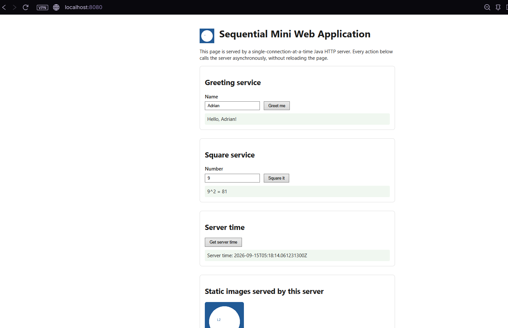
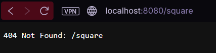
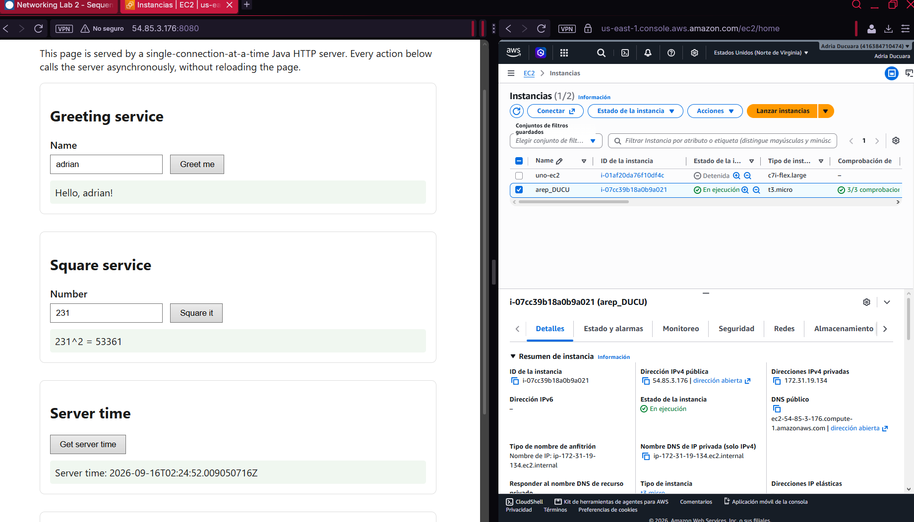
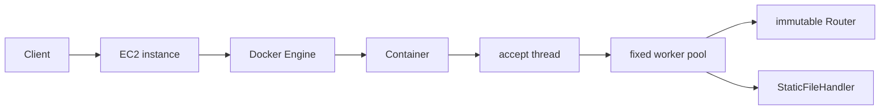

# Networking Lab 2 — From a Minimal HTTP Server to a Web Application on AWS

## 1. Project description

This project extends a minimal, socket-based Java HTTP server into a small web
application. It serves static resources (HTML, JavaScript, images), exposes JSON
services, and can run locally, in Docker, or on a single AWS EC2 instance.

The problem it addresses is pedagogical: before distributing load across multiple
servers or threads, it is necessary to understand what a single, sequential server
actually does — where requests wait, what one connection costs, and which design
decisions (statelessness, explicit routing, byte-accurate responses) make future
concurrency and distribution possible. This lab intentionally stops short of
concurrency: **the base stage used no threads or thread pools. The extension in
section 15 introduces bounded concurrency and graceful shutdown without adding a
web framework.**

## 2. System metaphor and architecture

**Metaphor: several teller counters.** The base lab had one bank teller (the server)
serving one customer (an HTTP connection) at a time. The extension adds several
tellers (pool workers) serving customers in parallel while sharing the same filing
cabinet (the static directory) and lobby directory (the router). The `ServerSocket`
is still the single entrance, and an acceptor assigns each customer to a teller.
A customer
walks up, hands over a slip of paper with a request (the HTTP request line), the
teller reads it, does exactly one of three things — hands over a form/photo from
the filing cabinet (a static resource), performs one of four fixed calculations from
a printed reference sheet (a hardcoded service), or says "that's not something we
handle" (404/405/400). The browser is the customer's assistant: it can prepare and
send several slips at once from the asynchronous JS client, and the extension now
lets the server process those connections concurrently.

**Components and responsibilities:**

- **Browser (JS client, `webroot/app.js`)** — sends `fetch()` requests to
  `/api/...` endpoints without reloading the page; shows loading/result/error states.
- **HTTP request line over TCP** — the protocol contract between browser and server.
- **`SimpleHttpServer`** — owns the listening `ServerSocket`; its acceptor delegates
  connections to a fixed worker pool and coordinates graceful shutdown.
- **`HttpRequestParser` / `HttpRequest`** — reads raw bytes off the socket and turns
  them into a parsed method + path + query params.
- **`StaticFileHandler`** — the filing cabinet: serves files from `webroot/`,
  normalizing and validating paths so nothing outside `webroot/` is ever reachable.
- **`ApiHandler`** — the reference sheet: recognizes exactly four hardcoded paths
  with explicit `if`/`else`, computes a response, and returns JSON.
- **`HttpResponse`** — writes a correct HTTP/1.1 response (status line, headers,
  blank line, byte body) regardless of whether the body is text or binary.
- **AWS EC2 instance** — changes *where* the teller counter physically sits (a
  remote host reachable over the internet through a security group), not *how* it
  works.

```
+-----------+        HTTP over TCP        +---------------------------+
|  Browser  | <--------------------------> |  EC2 instance (1 vCPU)   |
| (app.js)  |                              |  SimpleHttpServer        |
+-----------+                              |   |-- StaticFileHandler  |
                                            |   |-- ApiHandler         |
                                            |   `-- webroot/ (files)  |
                                            +---------------------------+
                                            security group: SSH (your IP),
                                            app port (lab-scoped)
```

*(Replace this ASCII sketch with a proper diagram image for submission — see
"Evidence and results" below.)*

## 3. Design decisions

- **Why the fixed pool:** the base lab made the sequential cost visible first;
  section 15 adds a bounded pool so slow clients do not serialize all traffic.
- **Why hardcoded routes:** `ApiHandler` uses direct `if`/`else` comparisons on the
  literal path instead of a router, reflection, or annotations, so the request → code
  mapping is fully explicit and traceable by reading one method top to bottom.
- **How content types are selected:** `ContentTypeResolver` maps file extensions to
  MIME types from a fixed table; anything outside that table is treated as
  unsupported and produces a 404, rather than guessing.
- **How unsafe paths are rejected:** `StaticFileHandler` resolves the requested path
  against the absolute, normalized `webroot` directory and rejects (404) any result
  that does not still start with that directory — this stops `../../etc/passwd`-style
  traversal without needing an allow-list of exact files.
- **Why the browser client is asynchronous:** `fetch()` keeps the page responsive
  while a request is in flight, but this is a client-side property only — it does
  not and cannot make the server concurrent (see Known limitations, and the
  discussion questions below).

## 4. Project structure

```
networking-lab2/
├── pom.xml
├── webroot/                  # public resources area (served as-is, not compiled in)
│   ├── index.html
│   ├── app.js
│   └── images/
│       ├── logo.png
│       └── banner.png
├── src/
│   ├── main/java/edu/eci/arem/lab2/
│   │   ├── Main.java                    # entry point, environment configuration
│   │   ├── config/ServerConfig.java     # validated environment variables
│   │   ├── server/SimpleHttpServer.java # acceptor, pool, graceful shutdown
│   │   ├── http/                        # request/response/content-type plumbing
│   │   ├── handler/                     # StaticFileHandler, ApiHandler
│   │   └── util/JsonUtil.java           # manual JSON escaping
│   └── test/java/edu/eci/arem/lab2/     # JUnit 5 tests (parser, JSON escaping)
└── .gitignore
```

`webroot/` is intentionally **outside** `src/main/resources`: it is deployed
*alongside* the jar (not bundled inside it), which is what lets the exact same
build artifact run against a local `webroot/` or a remote one on EC2 without
rebuilding.

## 5. Prerequisites

- Java 21+ (JDK) — the code targets Java 21.
- Maven 3.8+
- A terminal / browser to test locally.
- For deployment: an AWS account with EC2 access, per your instructor's
  approved account/region/image.

## 6. Installation and build

```bash
git clone <TODO: your repository URL>
cd networking-lab2
mvn clean test # runs the JUnit test suite
mvn package   # produces target/networking-lab2.jar (runnable fat jar)
```

## 7. How to run locally

```bash
# from the project root, so webroot/ is found via the relative default path
PORT=8080 STATIC_FILES_PATH=webroot APP_ENV=development \
  java -jar target/networking-lab2.jar
```

- `PORT` — listening port (defaults to `8080`).
- `STATIC_FILES_PATH` — public resources directory (defaults to `webroot`).
- `APP_ENV=development` enables `/shutdown` and `/api/slow`; production disables both.

Then open `http://localhost:8080/` in a browser. Shut down with `Ctrl+C`.

## 8. How to use the application

- The home page shows a **greeting** form (name → `Hello, <name>!`), a **square**
  form (number → its square), and a **server time** button.
- All three actions call the server asynchronously; the page never reloads.
- Invalid input (missing/non-numeric value) shows a friendly inline error, not a
  raw stack trace or HTTP status dump.
- Direct service URLs, for manual testing:
  - `GET /api/greeting?name=Ada` → `{"greeting":"Hello, Ada!"}`
  - `GET /api/square?value=7` → `{"input":7,"square":49}`
  - `GET /api/time` → `{"serverTime":"..."}`
  - `GET /api/health` → `{"status":"UP"}`

## 9. How to run the tests

- **Automated:** `mvn test` runs `HttpRequestParserTest` (request-line parsing,
  query-string decoding, malformed-request rejection, JSON escaping).
- **Manual integration checks** (run the server, then from another terminal):

```bash
curl -s http://localhost:8080/                         # 200, text/html
curl -s -o /dev/null -w "%{http_code}\n" http://localhost:8080/does-not-exist.html   # 404
curl -s -o /dev/null -w "%{http_code}\n" -X POST http://localhost:8080/              # 405
curl -s http://localhost:8080/api/greeting?name=Ada     # 200, JSON
curl -s -w "\n%{http_code}\n" http://localhost:8080/api/greeting                     # 400, missing param
curl -s -w "\n%{http_code}\n" "http://localhost:8080/api/square?value=abc"           # 400, invalid number
curl -s -o /dev/null -w "%{http_code}\n" "http://localhost:8080/../../etc/passwd"    # 404, traversal blocked
for i in $(seq 1 10); do curl -s -o /dev/null -w "%{http_code} " http://localhost:8080/api/health; done  # ten 200s
```

- **Concurrency check:** run several `/api/slow?ms=3000` requests together and
  compare the total time with the sequential baseline. Section 15 documents the
  automated test and the measurement placeholder.

## 10. AWS deployment (historical process)

1. `mvn package` locally to produce `target/networking-lab2.jar`.
2. Launch one EC2 instance (course-approved image/size); security group: SSH
   restricted to your IP, application port open per instructor guidance.
3. Copy the jar and `webroot/` to the instance, e.g.:
   ```bash
   scp target/networking-lab2.jar webroot -r ec2-user@<TODO: instance-ip>:/home/ec2-user/app/
   ```
4. On the instance, install Docker, then use the container deployment in section 15.
  The earlier direct-Java command was:
   ```bash
   cd /home/ec2-user/app
   java -jar networking-lab2.jar 8080 webroot
   ```
5. Verify `curl http://localhost:8080/api/health` from *inside* the instance first,
   then `http://<TODO: instance-public-ip>:8080/` from your own machine.
6. The current deployment path is Docker. The systemd unit below is retained only
  as a historical alternative for the pre-container lab.

**TODO** — example systemd unit (adjust paths/user, then place at
`/etc/systemd/system/networking-lab2.service`):
```ini
[Unit]
Description=Networking Lab 2 HTTP server
After=network.target

[Service]
WorkingDirectory=/home/ec2-user/app
ExecStart=/usr/bin/java -jar networking-lab2.jar 8080 webroot
Restart=on-failure
StandardOutput=append:/var/log/networking-lab2.log
StandardError=append:/var/log/networking-lab2.log

[Install]
WantedBy=multi-user.target
```
```bash
sudo systemctl daemon-reload
sudo systemctl enable --now networking-lab2
```

No credentials, private keys, or private IPs are committed to this repository.

## 11. Evidence and results

**TODO (fill in before submission):**
- 
- 
- 
- 


## 12. Known limitations

This server is intentionally **not production-ready**:
- The extension uses a fixed worker pool, but remains a small single-process server
  with no load balancing, TLS termination, authentication, or persistence.
- It supports only the `GET` method and a small set of explicitly registered routes.
- It has no authentication, no HTTPS/TLS, no persistence, and no request logging
  beyond stdout.
- It is a teaching server for concurrency, lifecycle management, containers, and
  deployment — not a general-purpose web server.

## 13. Author and acknowledgment

Cristian Adrian Ducuara Quiñonez. Built for the AREP Networking Lab · Part 2
course assignment. External references used: the official AWS EC2 documentation
linked in the lab guide (From a Minimal HTTP Server to a Web Application on AWS--moodle).

---

## 14. Web Framework Extension — Maintainable Application Server
 
This section documents the evolution of the sequential HTTP server described
in sections 1–13 above into a small lambda-based web framework, per the
"Building and Deploying a Maintainable Application Server" assignment.
The statements above describe the earlier stages; this section records the later
additive framework changes. The framework
API lives in `edu.eci.arem.lab2.framework` (`Router`, `Service`, `Response`,
`WebFramework`); `ApiHandler` was retired, and its four routes now register
through `get(...)` in `Main.java`.
 
### 14.1 Extended metaphor
Reusing the teller metaphor from section 2: the **lobby directory** (`Router`)
tells each teller which reference-sheet
procedure (`Service` lambda) to run for a given request, so adding a new
procedure means updating the directory — not retraining the teller.
`WebFramework` is the counter's manager: it decides which directory and
which filing cabinet path (`staticfiles(...)`) are in use before the counter
opens for the day (`start()`), and can call "closing time" (`stop()`) once
the current customer has been fully served.
 
### 14.2 Framework API used
| Method | Purpose |
|---|---|
| `staticfiles(String root)` | Sets the static-resource root directory |
| `get(String path, Service service)` | Registers a GET route with a lambda handler |
| `start()` / `start(int port)` | Starts the server and its worker pool |
| `stop()` | Initiates the idempotent graceful shutdown |
 
### 14.3 New/updated environment variables
| Variable | Purpose | Local default |
|---|---|---|
| `PORT` | HTTP server port | `8080` |
| `GREETING_PREFIX` | Prefix used by `/api/greeting` | `Hello` |
| `APP_ENV` | `development` enables `/shutdown`; any other value disables it | `development` |
| `STATIC_FILES_PATH` | Root folder for static resources | `webroot` |
| `POOL_SIZE` | Fixed worker-pool size | `availableProcessors() * 2`, minimum `1` |
| `SHUTDOWN_TIMEOUT_SECONDS` | Graceful-shutdown wait limit | `10` |
 
### 14.4 How to run locally (updated)
```bash
mvn package
PORT=8080 APP_ENV=development GREETING_PREFIX=Hello \
  java -jar target/networking-lab2.jar
```
`args[]` is not read by `Main`; all configuration is environment-based.
 
### 14.5 Cloud deployment (historical note)
The current deployment uses Docker as documented in section 15. The old systemd
process configuration from the first deployment stage remains above only as a
historical alternative.
**Cloud platform:** AWS EC2 (same instance as section 10).
**Public URL:** `<TODO: public EC2 URL>`
 
### 14.6 Example URLs
- Static: `http://<ip>:8080/`, `http://<ip>:8080/styles.css`, `http://<ip>:8080/images/logo.png`
- Dynamic: `http://<ip>:8080/api/greeting?name=Pedro`, `http://<ip>:8080/api/square?value=7`
- Dev-only: `http://<ip>:8080/shutdown` (expect 404 in production)

### 14.7 Additional tests
```bash
curl -s "http://localhost:8080/api/greeting"                          # missing name -> defaults to "world"
curl -s -o /dev/null -w "%{http_code}\n" "http://<ip>:8080/shutdown"  # 404 expected when APP_ENV=production
```
 
### 14.8 Why this stays maintainable
Adding a new service now means one `get(...)` call in `Main.java` — no edits
to `SimpleHttpServer`, `Router`, or the socket-handling loop. Routing,
request parsing, static-file resolution, and the acceptor/worker boundary remain
separately testable components, each with one responsibility.

---

## 15. Framework Extension — Concurrency, Graceful Shutdown and Containers

The current framework keeps the small JDK-only architecture and adds a bounded
worker pool, idempotent graceful shutdown, environment configuration, and a
container image ready for EC2. The acceptor thread only accepts sockets; workers
read, route, respond, and always close their socket. The router publishes immutable
snapshots after route registration, so concurrent reads are safe.

### 15.1 Execution model


```mermaid
flowchart LR
    Client[Client] --> EC2[EC2 instance]
    EC2 --> Docker[Docker Engine]
    Docker --> Container[Container]
    Container --> Acceptor[accept thread]
    Acceptor --> Pool[fixed worker pool]
    Pool --> Router[immutable Router]
    Pool --> Static[StaticFileHandler]
```

The updated metaphor is several tellers working in parallel from the same
directory: the acceptor is the lobby attendant, the pool workers are tellers,
the router is the directory, and `webroot/` is the shared filing cabinet.

### 15.2 Extension changes

- **Concurrency:** `POOL_SIZE` controls a fixed `ExecutorService`; a socket read
  timeout of 10 seconds prevents a slow client from holding a worker forever.
- **Graceful shutdown:** `stop()`, development `/shutdown`, and the JVM shutdown
  hook share the same idempotent path. It stops accepting, closes the listening
  socket, waits for workers, and interrupts only after the configured timeout.
- **Environment configuration:** invalid numeric values produce a clear stderr
  diagnostic and use a safe default.
- **Development endpoint:** `GET /api/slow?ms=3000` sleeps for up to 10 seconds
  and is available only when `APP_ENV=development`.
- **Container:** Java 21 runs as PID 1 through the exec-form Docker entrypoint.

### 15.3 Environment variables

| Variable | Default | Validation / purpose |
|---|---:|---|
| `PORT` | `8080` | Integer from 1 to 65535 |
| `STATIC_FILES_PATH` | `webroot` | Static-resource directory |
| `APP_ENV` | `development` | Enables `/shutdown` and `/api/slow` only in development |
| `GREETING_PREFIX` | `Hello` | Prefix for `/api/greeting` |
| `POOL_SIZE` | `availableProcessors() * 2` | Integer, minimum 1 |
| `SHUTDOWN_TIMEOUT_SECONDS` | `10` | Positive integer graceful-shutdown limit |

### 15.4 Build and run locally

```bash
mvn clean test
mvn package
PORT=8080 APP_ENV=development POOL_SIZE=4 \
  java -jar target/networking-lab2.jar
```

Useful checks:

```bash
curl -i http://localhost:8080/api/health
curl -i "http://localhost:8080/api/slow?ms=3000"
curl -i http://localhost:8080/shutdown
```

### 15.5 Docker

```bash
mvn package
docker build -t <TODO: dockerhub-user>/networking-lab2:latest .
docker run --name networking-lab2 -p 8080:8080 \
  -e APP_ENV=production -e POOL_SIZE=4 \
  --restart unless-stopped \
  <TODO: dockerhub-user>/networking-lab2:latest
curl -i http://localhost:8080/api/health
docker stop networking-lab2
```

`compose.yaml` provides the equivalent local workflow with `docker compose up -d`
and `docker compose down`. The Docker daemon was not running during this update,
so the image build, health request, and stop-log verification remain TODO.

### 15.6 EC2 deployment with Docker

1. Launch an approved EC2 instance and allow TCP 22 only from the administrator's
   IP and TCP 8080 from the intended clients in its security group.
2. Install Docker on the instance and authenticate to the registry if needed.
3. Publish and pull the image:
   ```bash
   docker pull <TODO: dockerhub-user>/networking-lab2:latest
   ```
4. Run it with restart policy and production configuration:
   ```bash
   docker run -d --name networking-lab2 \
     -p 8080:8080 \
     -e PORT=8080 -e APP_ENV=production \
     --restart unless-stopped \
     <TODO: dockerhub-user>/networking-lab2:latest
   ```
5. Verify locally on the instance with `curl http://localhost:8080/api/health`,
   then verify the public endpoint after the security group is active.

**Docker Hub URL:** `<TODO: Docker Hub repository URL>`
**Public EC2 URL:** `<TODO: public EC2 DNS or IP URL>`

### 15.7 Evidence and remaining limitations

- Concurrency measurement before extension: `<TODO: N requests took ... ms>`.
- Concurrency measurement with extension: `<TODO: N requests took ... ms>`.
- Docker build/health/stop evidence: `<TODO: capture terminal output or screenshot>`.
- EC2 evidence: `<TODO: capture security group, running container, and health response>`.
- Commit evidence: `<TODO: commit hash + link>`.
- Remaining limitations: GET-only API, no TLS, authentication, persistence, or
  load balancing; static resources remain local to each container; no production
  observability or request backpressure policy beyond the fixed pool.

---

## Discussion questions (section 8.2)

**Answers :**

1. *Why does a single HTML page cause several HTTP requests?* Because the HTML
   document references separate resources (script, images) that the browser
   discovers only after parsing the HTML, and fetches with independent requests.
2. *Why must image responses be treated as bytes rather than text?* Images are
   binary data; decoding/re-encoding them as characters (e.g. via a text charset)
   would corrupt the bytes. Reading everything as `byte[]` keeps one reliable path
   for both text and binary resources.
3. *What is the role of the response content type?* It tells the browser how to
   interpret the body (render as HTML, execute as JS, decode as an image), rather
   than leaving that to guesswork.
4. *What is hardcoded, and what would a routing framework eventually generalize?*
   The four service paths are hardcoded via `if`/`else`; a framework would
   generalize path-matching (patterns, parameters), method dispatch, and handler
   registration so new routes don't require touching a central `if` chain.
5. *Why can the browser stay responsive while the server is still sequential?*
   Because responsiveness is a client-side property of asynchronous JavaScript
   (the UI thread isn't blocked waiting for `fetch()`), which is independent of
   how the server processes the underlying TCP connections.
6. *What changed on EC2? What didn't?* The network location/reachability and the
  physical host changed; the application code and its explicit routing contract
  did not. The extension additionally packages the app as a Docker container.
7. *What happens when two users send slow requests at almost the same time?* The
  base lab answer is that the second user's request waits at the OS's connection
  backlog / `accept()` call until the first cycle completes. In the extension,
  the acceptor delegates both requests to workers, so they can overlap when the
  pool has capacity.
8. *What's the next architectural limitation, and why concurrency before load
  balancing?* This answer describes the sequential base lab: its next limitation
  was the single-threaded capacity ceiling. The extension removes that specific
  bottleneck with a fixed pool; the next limits are still one process, one host,
  and no load balancing or backpressure policy.
